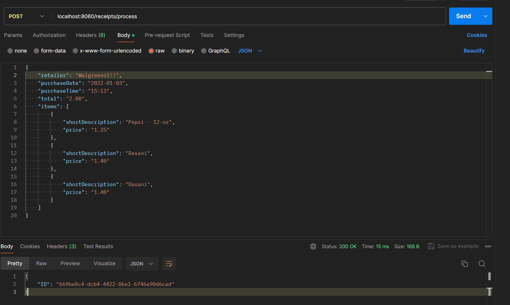
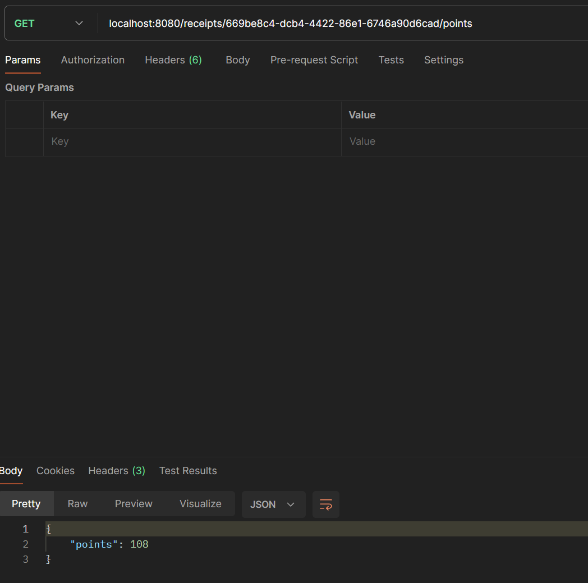

# Receipt Processor Webservice Solution

## Introduction

This project aims to build a webservice that processes receipts based on the provided API specifications given by Fetch. The webservice will have two endpoints: one for processing receipts and another for retrieving the points associated with a receipt.

## Language Used

For this project I am using GO Language.

## Running the Application

### From Go Project:

1. Ensure you have Go installed on your machine (Assuming it is already installed as stated in the README).
2. Clone the repository: `git clone https://github.com/PV1shal/receipt-processor-challenge.git`
3. Navigate to the project directory: `cd receipt-processor`
4. Run the application: `go run .`

### From the executable file

1. Ensure you have the executale file which was submitted as an Attached file in the submission link.
2. Navigate to the file where the executable file is.
3. Run the following command:
    - On macOS or Linux, `./receipt-processor-challenge`
    - On Windoes, `./receipt-processor-challenge.exe`
            

## Running Test

I have added a few tests for testing this project. The tests follows the examples given in the question. 

### To run the tests

1. Navigate to the project directory: `cd receipt-processor`
2. Nagivate to the routes directory: `cd route`
3. Run the test: `go test .`

## API Specification

### Endpoint: Process Receipts

- **Path:** `/receipts/process`
- **Method:** POST
- **Payload:** Receipt JSON
- **Response:** JSON containing an id for the receipt.

### Endpoint: Get Points

- **Path:** `/receipts/{id}/points`
- **Method:** GET
- **Response:** A JSON object containing the number of points awarded.

## Assumptions Made:

- Assuming all the inputs are sent in the same data type as given in the question's example.
- For the rule, <i>6 points if the day in the purchase date is odd.</i> I am assuming that by odd you meant if the **Day** is Odd, for example, 01-03-2024 (MM-DD-YYYY), 03 is odd, hence I would add 6 points.

## General Workflow:

1. Run the Application by following the above instructions.
2. Using an API client such as Postman send a POST receipt request to the server. Do remember to send the receipt in the body of the request. (Screenshot added below)
3. Using the ID response from the previous POST request we can call a GET receipt request to get the points awarded.

**NOTE: IF THE ID DOES NOT EXIST IN THE TEMPORARY STORAGE, REPONSE 'NOT FOUND' WILL BE SENT**

## Screenshots
- POST Request

- GET Request
